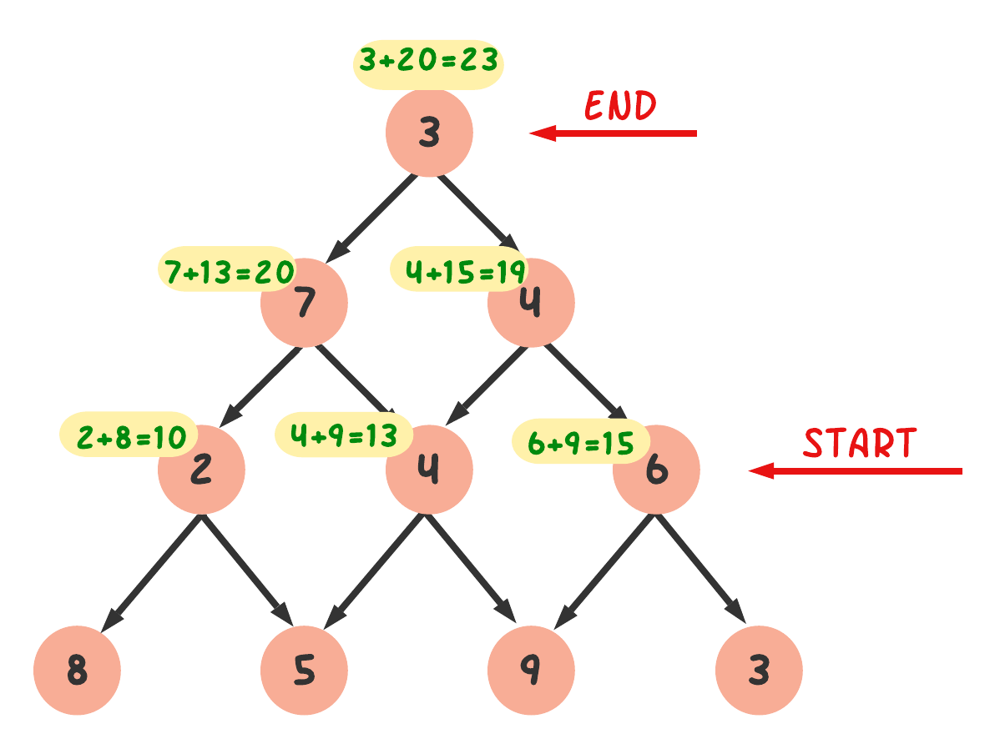

#### Problem: 
By starting at the top of the triangle below and moving to adjacent numbers on the row below, the maximum total from top to bottom is 23.

```html
   3
  7 4
 2 4 6
8 5 9 3
```

That is, `3 + 7 + 4 + 9 = 23`
Find the maximum total from top to bottom of the triangle below:
```html
                      75
                    95 64
                   17 47 82
                 18 35 87 10
                20 04 82 47 65
               19 01 23 75 03 34
              88 02 77 73 07 63 67
            99 65 04 28 06 16 70 92
           41 41 26 56 83 40 80 70 33
         41 48 72 33 47 32 37 16 94 29
        53 71 44 65 25 43 91 52 97 51 14
       70 11 33 28 77 73 17 78 39 68 17 57
      91 71 52 38 17 14 91 43 58 50 27 29 48
    63 66 04 68 89 53 67 30 73 16 69 87 40 31
   04 62 98 27 23 09 70 98 73 93 38 53 60 04 23
```

<mark>Note:</mark> As there are only 16384 routes, it is possible to solve this problem by trying every route. However, Problem 67, is the same challenge with a triangle containing one-hundred rows; it cannot be solved by brute force, and requires a clever method!

#### Solution:

As the note describes, it is possible to solve this problem by finding all routes from the root and select the highest value. But when the row increases, it will become impossible to calculate all the routes. For example, in problem 67, there are 100 rows and there are $ 2^{99} $ routes altogether. If one can check one trillion ($ 10^{12} $) routes every second, it would require over twenty billion years to check $ 2^{99} $ routes.

The optimal solution can be found in dynamic programming(DP).

The solution can be implemented both a top-down and bottom-up approach. I found the bottom-up approach easier to understand. We will start with the bottom-most parent. By comparing the adjacent nodes, we take the highest one and add it with the parent. Going through the same process at every level, we will get the longest path sum at the root node!



At first, we need to process the input. From the input string, we make a nested list.  

```python
# Process the triangle as a nesteed list
def process_triangle(t):
    triangle = list()
    for line in t.splitlines():
        triangle.append(list(map(int, line.split())))
    return triangle

t = '''75
95 64
17 47 82
18 35 87 10
20 04 82 47 65
19 01 23 75 03 34
88 02 77 73 07 63 67
99 65 04 28 06 16 70 92
41 41 26 56 83 40 80 70 33
41 48 72 33 47 32 37 16 94 29
53 71 44 65 25 43 91 52 97 51 14
70 11 33 28 77 73 17 78 39 68 17 57
91 71 52 38 17 14 91 43 58 50 27 29 48
63 66 04 68 89 53 67 30 73 16 69 87 40 31
04 62 98 27 23 09 70 98 73 93 38 53 60 04 23
'''
triangle = process_triangle(t)
```

Starting from (list_length-1) we compare all the child nodes and took the highest one and sum it up with the parent. 

```python
# Find the maximum path sum
def maximum_path_sum(triangle):
    l = len(triangle)
    for i in range(l-2, -1, -1):
        for j in range(len(triangle[i])):
            # Compare the adjacent nodes
            if triangle[i+1][j] > triangle[i+1][j+1]:
                triangle[i][j] += triangle[i+1][j]
            else:
                triangle[i][j] += triangle[i+1][j+1]
    return triangle[0][0]

print(maximum_path_sum(triangle))
```

**Expected output: 1074**

###### Problem 67:

Without reproducing the same solution here as for Problem 67, I only can refer you same method, since the dynamic programming solution was optimal and can be used for this larger triangle as well. You only need to set the `t` with the new triangle with 100 rows.
